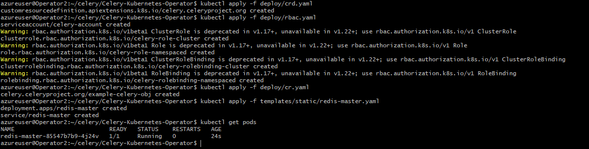
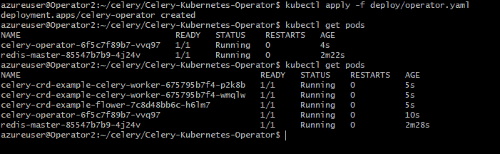
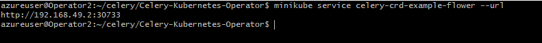
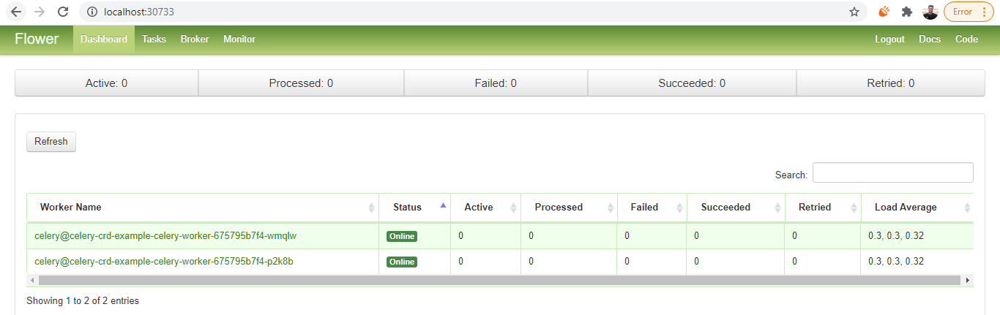
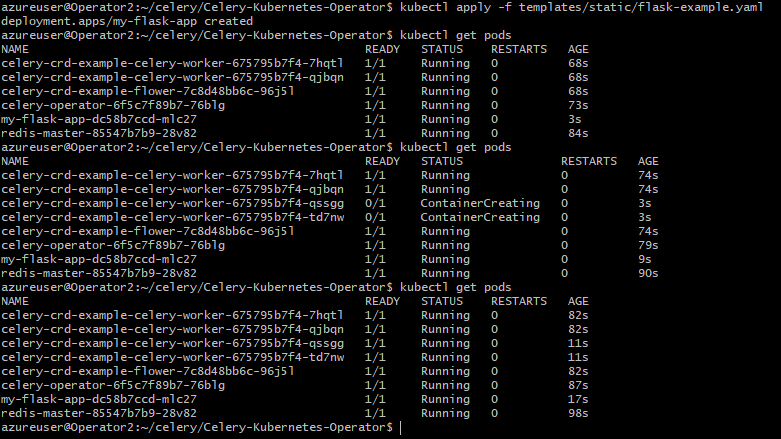
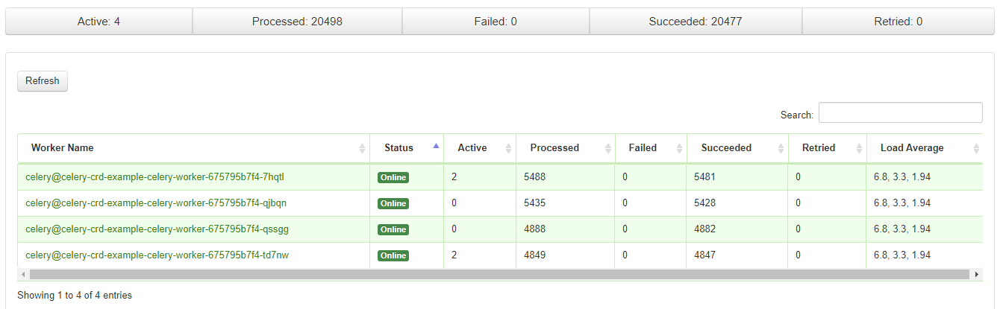
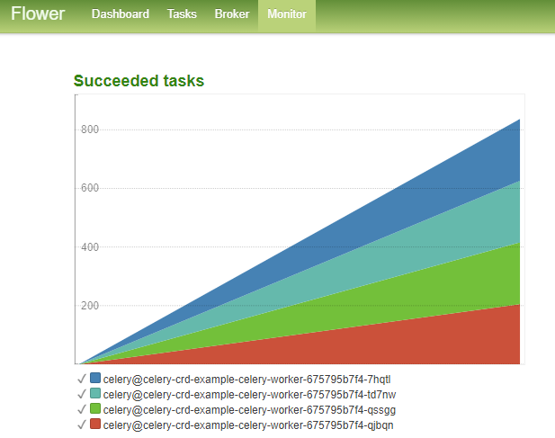
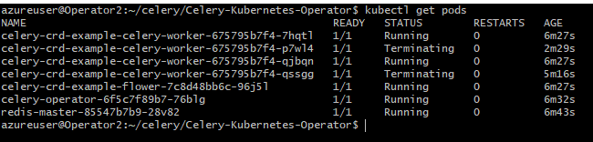
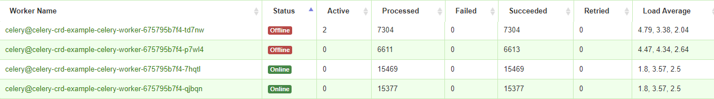

# Kubernetes operator for Celery

Due to unpredictable nature of some businesses, system's performance degrades when there is an unexpected load. In such cases, customers face inconvenience resulting in loss of reputation. Usually in such situations, components are scaled up either manually or by some process in automation. On the other hand, scaling down is a challenging operation to be done manually, else we will have idle systems and still being an expenditure to the organization. 

To overcome one such bottleneck in Celery worker process, this operator will help to deploy, autoscale and deprovision when it is deployed in Kubernetes. Primarily it deploys the required celery workers, a flower component to monitor them and a redis backend. When the system load increases, it scales up the number of celery worker pods until a maximum customizable units. Also once the load reduces, it will scaledown the pods to the minimum number, which can also be customized.

# Pre-requisites

- Working Kubernetes cluster 
- Account with cluster admin privileges
- Access to internet

This operator was deployed and tested with minikube V1.22, Ubuntu linux 5.8, though technically this could work on other platforms after testing.

# Deployment and autoscale

For simplicty, the deployments were made in default namespace, but can be customized by modifying the values.  

Download the code to your machine where you are performing the deployment.

- Create custom resource definition(CRD) for this operator.

             kubectl apply -f deploy/crd.yaml
            
- Create service account and role bindings for the service account
 
             kubectl apply -f deploy/rbac.yaml
             
- Create custom resource for this operator.

             kubectl apply -f deploy/cr.yaml

- Deploy redis, which in our  case is going to serve both as backend and broker. Post this step, we could see a pod created for redis.

             kubectl apply -f templates/static/redis-master.yaml

 

- Deploy the operator 

             kubectl apply -f deploy/operator.yaml

Note: In our testcase, we are using the repository images from github.com/pearlsprathap. If needed the images can be created using the dockerfile available in this repo.

At this moment, we can see the another pod getting created for operator. Also once the operator is created, it will further start creating other pods. One for flower and two for celery workers. This creates two celery workers initially since we have set minReplicas as 2 in cr.yaml

- As we can see now the flower deployment is completed and we can access the UI by finding the URL. 

             minikube service celery-crd-example-flower --url

Note: If we are performing this deployment in Azure or any public cloud, we can use ssh tunnel to access the flower UI. SSH tunnel can be done by creating SSH connection from a new window using -L option.

             ssh -i Operator2.pem azureuser@20.65.8.169  -L 30733:192.168.49.2:30733
             
- After doing SSH tunnel, we can access flower UI from the localhost using the URL - http://localhost:30733

We can see the dashboard, which shows the celery worker status in real time. In further tabs, we can see tasks/broker/monitor of the celery workers. 

Now that we have seen the deployment, we will test the autoscaling feature. For doing this, we are going deploy a sample application. This is a simple add operation which runs 10000 times in 3 batches. We have configured in CR if the message length is more than 100 it will autoscale and create a new pod. This number can be configured as needed. 

- Now let us deploy the simple application to flood tasks to the queue so that we can see the celery gets autoscaled. We can see that from the initial pod of 2, it will autoscale to 4. This example application will also create a pod for itself.

             kubectl apply -f templates/static/flask-example.yaml

As we can see in the below screenshot, we could see the celery workers are scaled up to 4 after deployment of the application.

This can also be seen from Flower UI.

- Now let us delete the flask application to see if the celery workers get scaled down.

             kubectl delete -f templates/static/flask-example.yaml
             

This can also be seen from Flower UI.

As we have seen in the above test case, we were able to deploy, autoscale and scale down using this operator. 

 # Further scope of this project
 
- We can replace RabbitMQ in place of Redis for broker and PostgreSQL as backend.
- Upgrade to code to use docker-compose to simplify deployments.

 # Reference and bibliography
 
 This project was inspired by the below references.
 
 - https://github.com/jmdacruz/celery-k8s-operator/tree/master/deploy
 - https://www.canva.com/design/DAD37xRhCDE/ZUdsvdIEcj9FXKdwDxOtyg/view?utm_content=DAD37xRhCDE&utm_campaign=designshare&utm_medium=link&utm_source=sharebutton#1
 - https://github.com/celery/Celery-Kubernetes-Operator
 - Europython 2020 presentations
 - https://github.com/celery/ceps/issues/24
